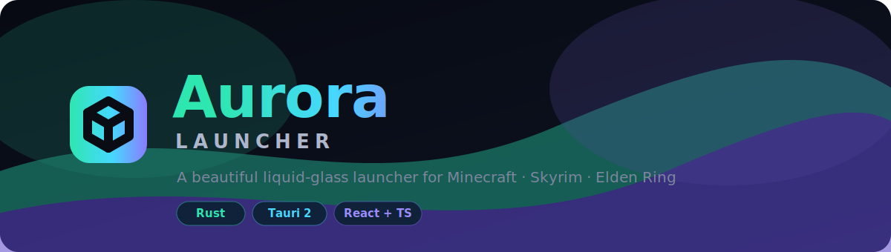
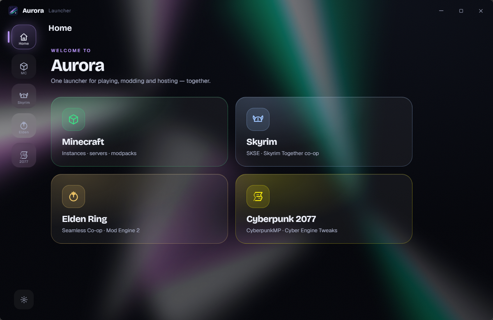
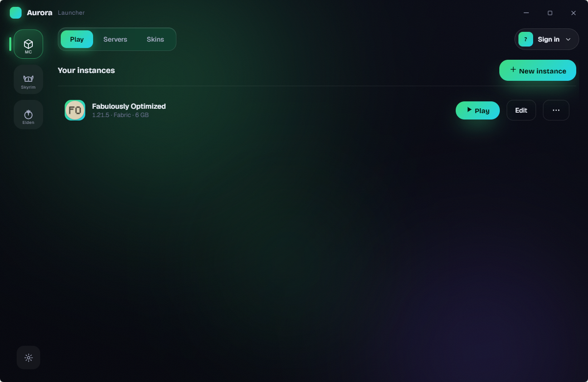
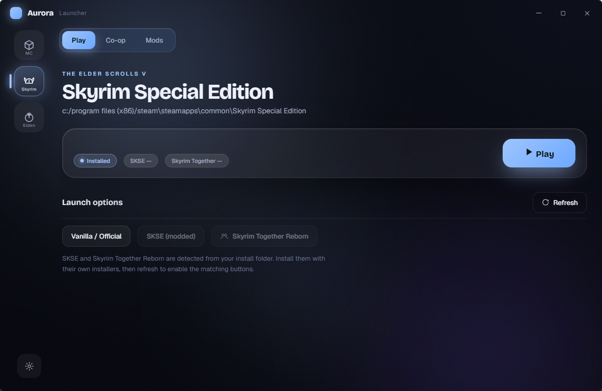
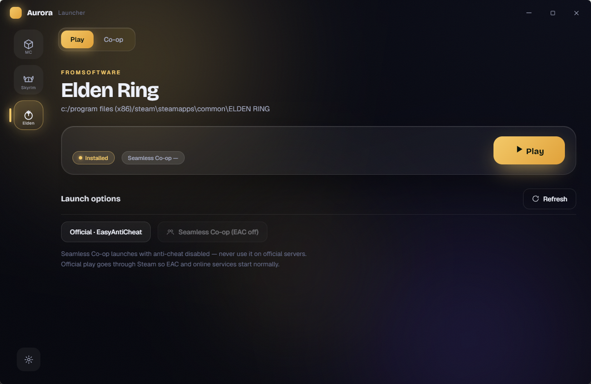
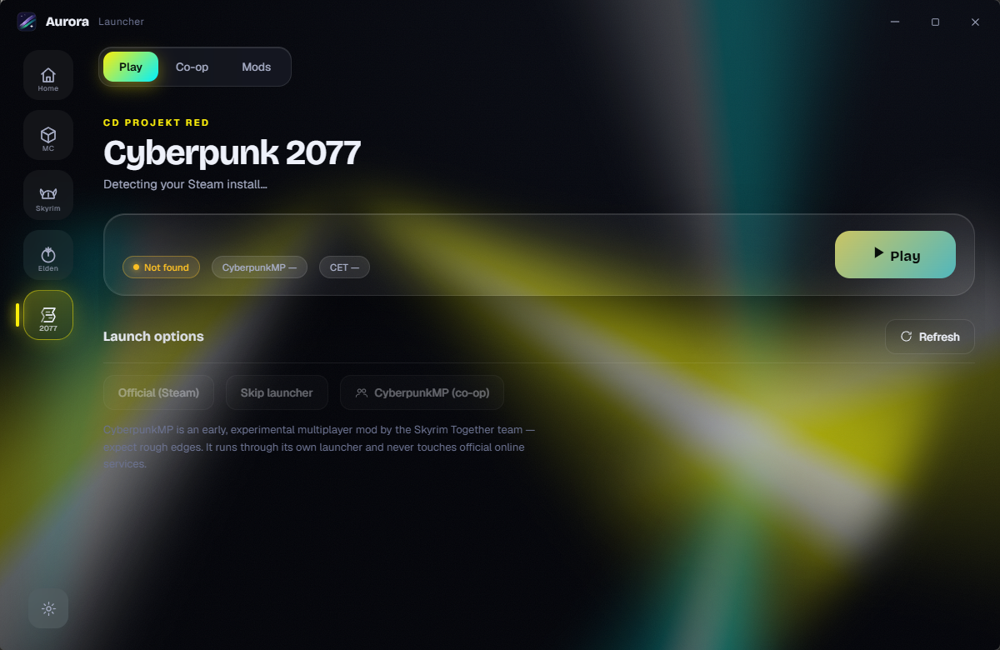
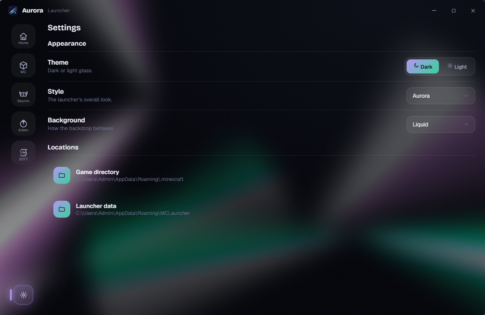
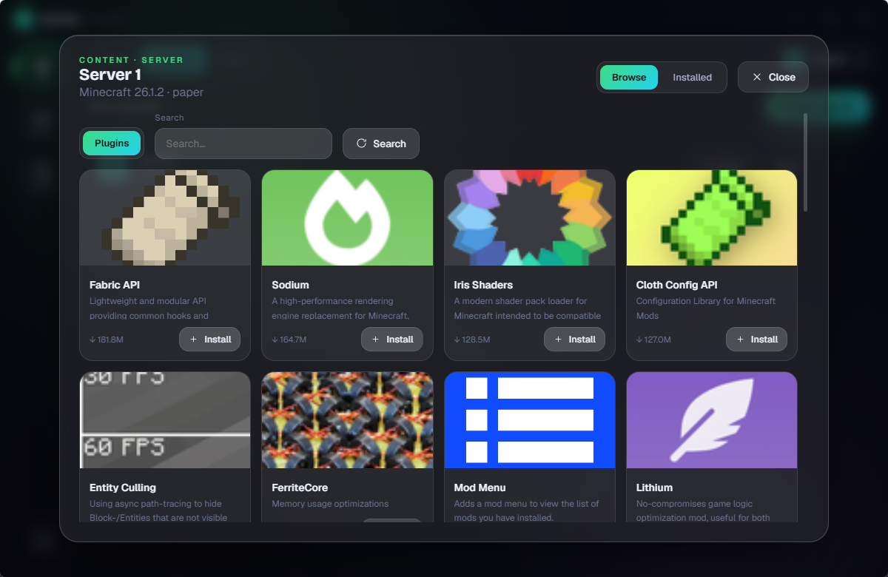

<div align="center">



# Aurora Launcher

**A beautiful, liquid-glass multi-game launcher** — host & play modded Minecraft, launch Skyrim Together, run Elden Ring Seamless Co-op, and jack into CyberpunkMP, all from one place.

[](https://www.rust-lang.org/)
[](https://tauri.app/)
[](https://react.dev/)
[](#)
[](LICENSE)

</div>

---

## ✨ Why Aurora?

Most launchers are powerful but cluttered, or pretty but limited. Aurora aims for both: a **clean, animated liquid-glass UI** on top of a fast **Rust** core that handles the heavy lifting — Java provisioning, mod-loader installs, server hosting, and authentication — with zero manual setup.

> One app to **play**, **host**, and **mod** — across Minecraft, Skyrim, and Elden Ring.

---

## 📸 Screenshots

| Home — pick a game | Minecraft — instances |
|:---:|:---:|
|  |  |
| **Skyrim — SKSE & Skyrim Together** | **Elden Ring — Seamless Co-op** |
|  |  |
| **Cyberpunk 2077 — CyberpunkMP & CET** | **Themes & settings** |
|  |  |
| **Content browser (per instance)** | **Server hosting — plugin browser** |
|  |  |

> The whole UI re-tints to each game — green for Minecraft, blue for Skyrim, gold for Elden Ring, neon yellow for Cyberpunk — with the launcher itself in aurora purple.

---

## 🎮 Features

### 🟩 Minecraft
| | |
|---|---|
| **Instances** | Unlimited isolated profiles — each with its own version, loader, mods, worlds & RAM |
| **Loaders** | Vanilla · **Fabric** · **Quilt** · **Forge** · **NeoForge** (auto-installed) |
| **Modpacks** | One-click install from **Modrinth**, **CurseForge**, **FTB** & **Technic** — right inside *New Instance* |
| **Server hosting** | Spin up **Vanilla / Paper / Fabric / Forge** servers with a live in-app dashboard (players, RAM, console) |
| **Content browser** | Search & install mods, shaders, resource packs and plugins, version-scoped per instance/server |
| **One-click upgrades** | Bump an instance/server to a newer Minecraft version *and* auto-update its mods |
| **Creative inventory editor** | A real slot-grid NBT editor — drop in any item (incl. modpack items) and add enchantments, no third-party tools |
| **Skins** | Upload and switch skins in-app |

### ⚔️ Skyrim
- Detects your install (**Steam or Epic**), SKSE, Skyrim Together, and Address Library
- **One-click SKSE install** straight from the official release
- Guided **Skyrim Together Reborn** setup (incl. its Address Library requirement) — Aurora finds the Nexus downloads and installs them to the right place

### 🔆 Elden Ring
- **One-click Seamless Co-op install** (official release) + in-app co-op password editor
- **Mod Engine 2** one-click install, a mods folder, and a *Launch Modded* button

### 🌃 Cyberpunk 2077
- Detects your install (**Steam or Epic**)
- **CyberpunkMP** one-click install — the experimental multiplayer mod by the Skyrim Together team
- **Cyber Engine Tweaks** one-click install for modding

### 🎨 The whole thing is *gorgeous*
- A **homepage** with big per-game tiles, in the launcher's own aurora purple/green identity
- **Liquid-glass UI** with three backdrops — Static, Pulsing, or **Liquid** (flowing iridescent chrome)
- **Light / Dark** themes + an **Aurora / Apple-style Liquid Glass** look with pointer "lensing" that brightens the glass under your cursor
- Everything re-tints to the active game's color; animated tab indicator, spring transitions, custom dropdowns throughout

---

## 🛠️ Tech stack

- **`launcher-core`** — Rust library: Mojang manifest, parallel download engine, Adoptium Java auto-download, Microsoft auth (browser "no-code" loopback **and** device-code fallback), Fabric/Quilt/Forge/NeoForge installers, Modrinth/CurseForge/FTB/Technic modpack installs, server hosting, NBT inventory editing.
- **`launcher-desktop`** — [Tauri 2](https://tauri.app/) shell + a React 18 / TypeScript / Vite frontend, bridged by typed commands.
- Packaged as an **NSIS** Windows installer.

```
crates/
├─ launcher-core/      # all the Rust logic (no UI)
└─ launcher-desktop/   # Tauri app
   ├─ src/             # React + TypeScript UI
   └─ src-tauri/       # Tauri commands bridging the core
```

---

## 🚀 Build from source

**Prerequisites:** [Rust](https://rustup.rs/) (stable), [Node.js](https://nodejs.org/) 18+, and the [Tauri prerequisites](https://tauri.app/start/prerequisites/) (on Windows: WebView2 + MSVC build tools).

```bash
# 1. Frontend deps
cd crates/launcher-desktop
npm install

# 2. Dev (hot-reload)
npm run tauri dev

# 3. Production build → installer in target/release/bundle/nsis/
npm run tauri build
```

### CurseForge modpacks (optional)
CurseForge modpack installs need a personal API key from [console.curseforge.com](https://console.curseforge.com/). It's **not** committed to this repo — provide it at build time:

```powershell
$env:AURORA_CF_KEY = "<your CurseForge key>"; npm run tauri build
```

Modrinth, FTB, sign-in and server hosting all work without any key.

---

## 🔐 Privacy & accounts

Aurora signs you in through the **official Microsoft OAuth flow** — it opens your browser, you sign in and approve, and Aurora captures the result over a temporary local redirect (no code to copy). A **device-code** fallback ("use a sign-in code instead") is available too. No passwords pass through the app, and tokens are stored locally on your machine. Once signed in, your account shows your live **skin portrait**. Offline accounts are supported for testing.

---

## 📜 Disclaimer

Aurora Launcher is an independent, fan-made project. It is **not** affiliated with, endorsed by, or associated with Mojang Studios, Microsoft, Bethesda, or FromSoftware. *Minecraft*, *Skyrim*, and *Elden Ring* are trademarks of their respective owners. You must own a legitimate copy of each game to play it.

## 📄 License

[MIT](LICENSE) © camwooloo
